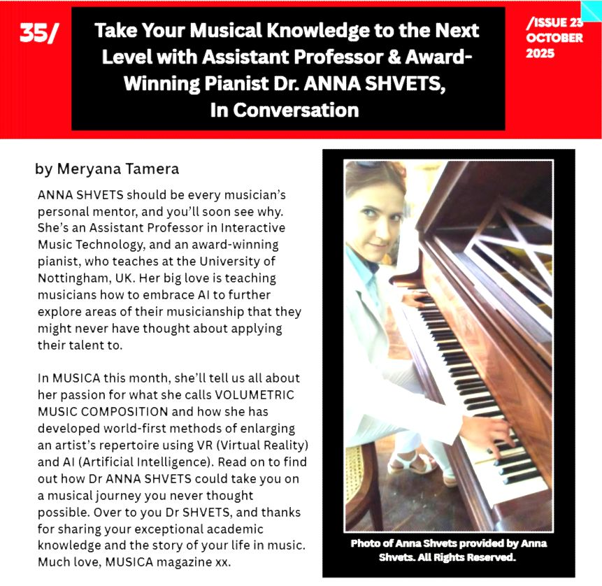
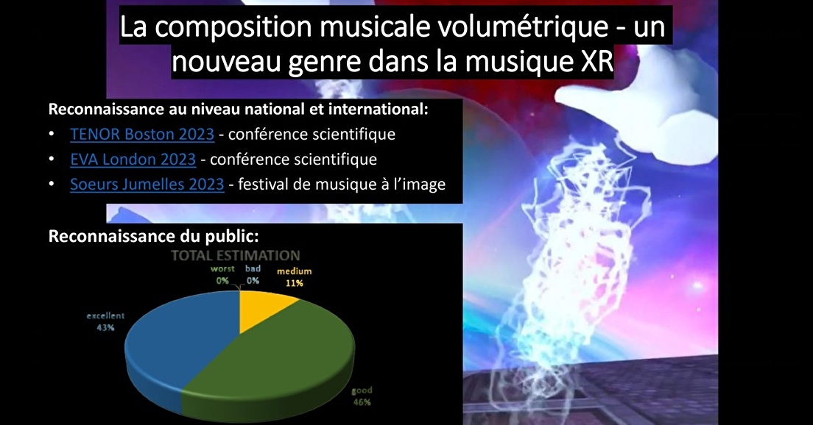
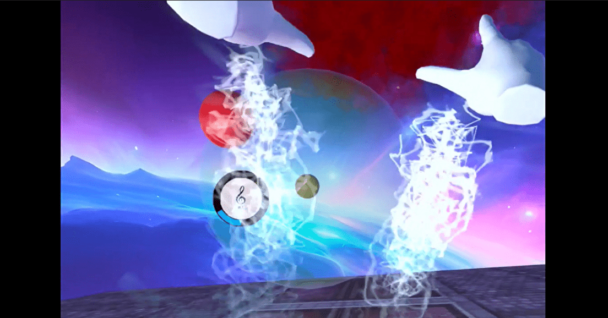
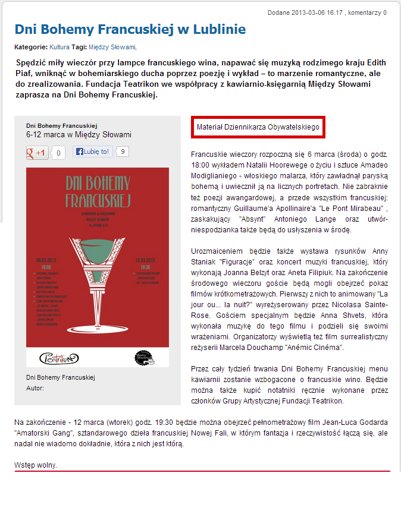
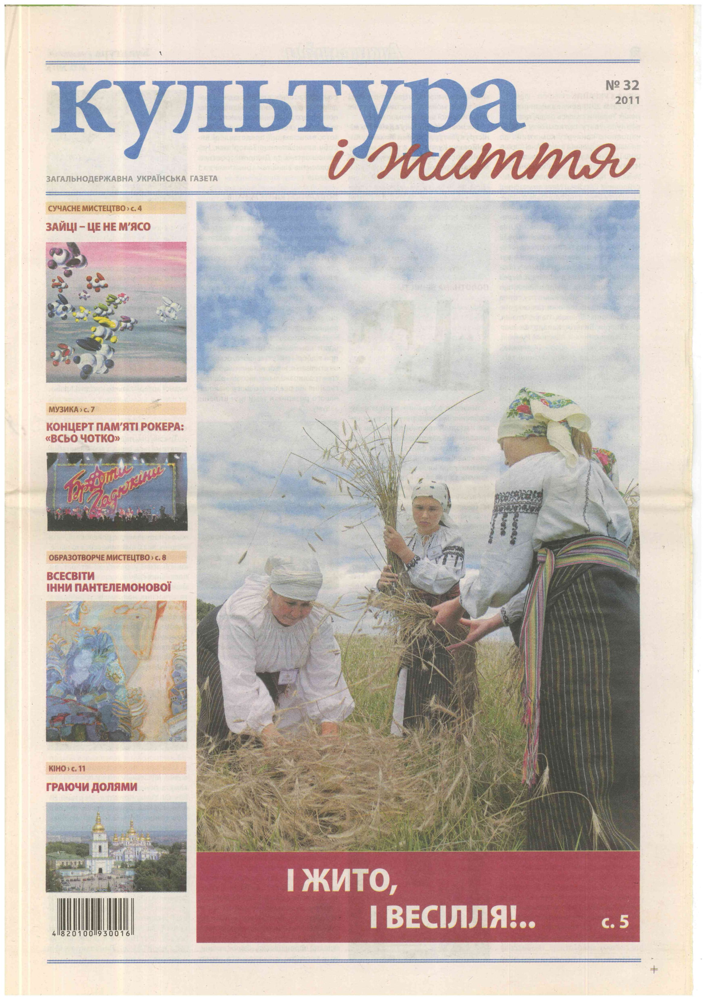
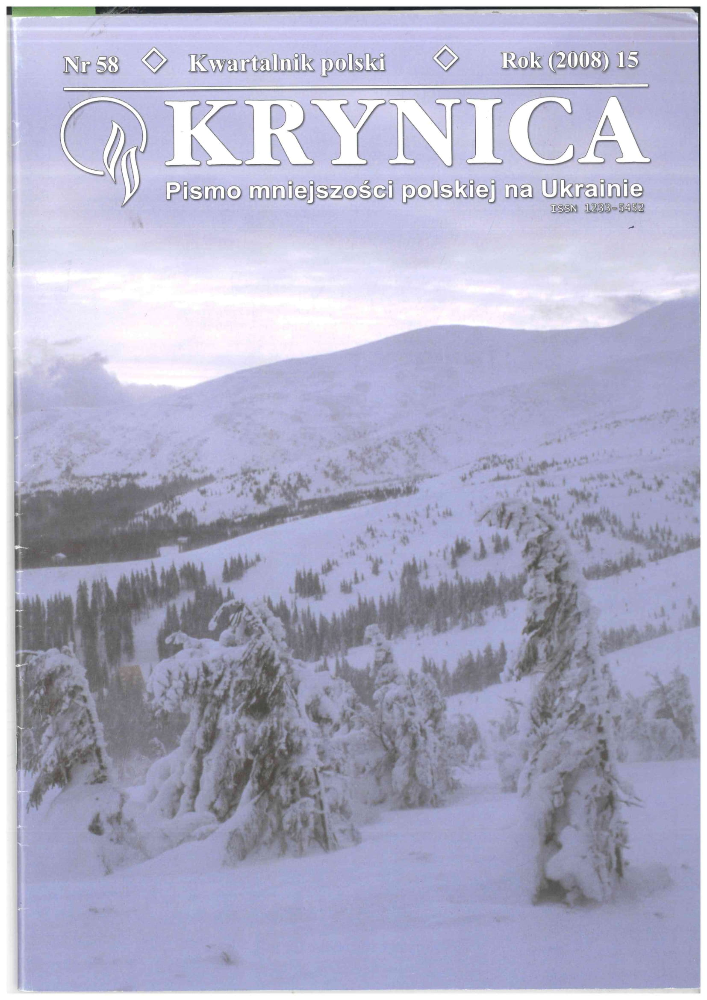
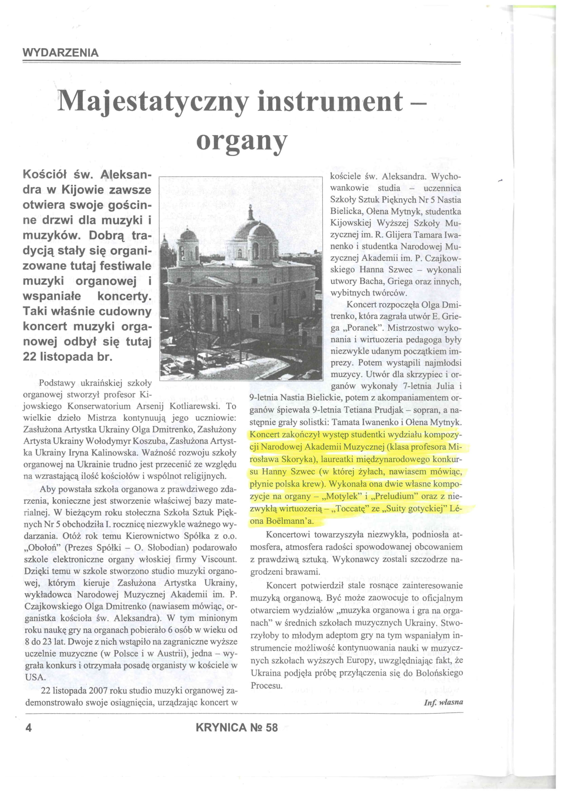

# Press about me

## **Musica magazine**

Excited to share that Musica magazine, curated by AudioSparx, has just published an interview with me (pp. 35–41).

In the interview, I talk about my current work in AI-powered immersive music as well as my wider musical journey.

You can read the full issue here: [AudioSparx](https://radiosparx.aflip.in/4a1f6a182a.html#page/34)

## **VRJAM award reception**

The first association of XR in France [AFXR – la 1ère asso française de la XR](https://www.linkedin.com/company/afxr/) has published the news article about the [VRJAM](https://www.linkedin.com/company/vrjam/) award attribution to our "Omega" VR application: https://www.afxr.org/articles/130286-le-projet-de-composition-musicale-volumetrique-recoit-le-prix-vrjam

## **"Omega" in press**

The first association of XR in France [AFXR – la 1ère asso française de la XR](https://www.linkedin.com/company/afxr/) has just highlighted our "Omega" VR project developed commonly with [Samer DARKAZANLI](https://www.linkedin.com/in/ACoAADJxgkgBlTo3ANJFrKBO5-oTrSM0WiCGjgc) on their site: https://www.afxr.org/articles/125316-la-composition-musicale-volumetrique-un-nouveau-genre-dans-la-musique-xr

It is an important step towards recognition of the volumetric music composition genre by the French XR community of scientists, artists and industry representatives!

## **Dni Bohemy Francuskiej w Lublinie** (in Polish)

Lublin Nasze Miasto (Lublin on-line Newspaper), 2013. [Link to the page](http://lublin.naszemiasto.pl/artykul/dni-bohemy-francuskiej-w-lublinie,2778530,art,t,id,tm.html)

"Na zakończeniu środowego wieczoru goście będą mogli obejrzeć pokaz filmów krótkometrażowych. Pierwszy z nich to animowany "La jour ou… la nuit?" wyreżyserowany przez Nicolasa Sainte-Rose. Gościem specjalnym będzie **Anna Shvets**, która wykonała muzykę do tego filmu i podzieli się swoimi wrażeniami."

## **One from Ukraine** (in Ukrainian)

Culture and Life (National Ukrainian Newspaper); issue 32, 2011, p. H1

"Мені було запропоновано написати музику до одного з п'яти анімаційних фільмів, надісланих оргкомітетом конкурсу. Анімація "Jour où…la nuit" ("День…де ніч"), що намалював молодий французький художник Ніколя Санте-Роз, викликала у мене музичні асоціації, які я відтворила у партитурі та надіслала до Франції. …з-поміж 104 учасників конкурсу … було обрано 12 фіналістів. … 11 липня 2011 року на престижній сцені П'єра Ламі мій твір був виконаний духовим квінтетом під керівництвом професора Ліонської консерваторії месьє Жана Марка Сера."

## **Majestatyczny instrument-organy** (in Polish)

Krynica (kwatalnik polski); Karios: Kyiv, 2008, p. 4

"Koncert zakończył występ studentki wydziału kompozycji Narodowej Akademii Muzycznej (klasa profesora Mirosława Skoryka), laureatki międzynarodowego konkursu **Hanny Szwec** (w której żyłach, nawiasem mówiąc, płynie polska krew). Wykonała ona dwie własne kompozycje na organy – „Motylek" i „Preludium" oraz z niezwykłą wirtuozerią – „Toccatę" ze „Suity gotyckiej" Léona Boëlmann'a."

